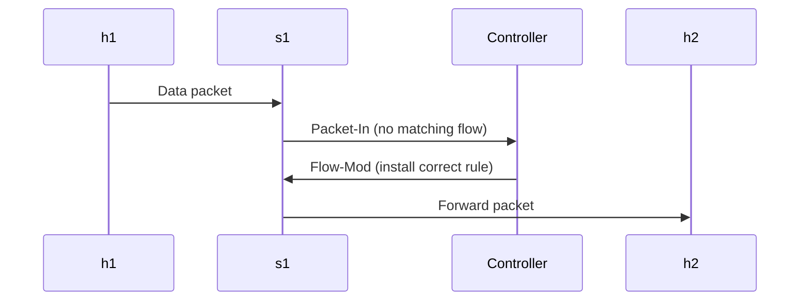
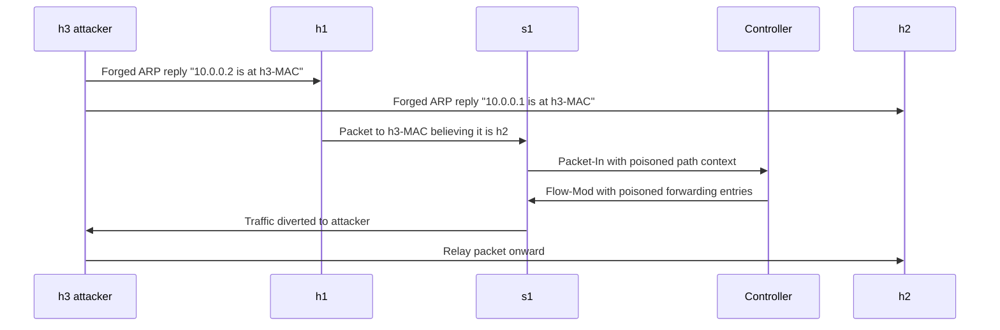
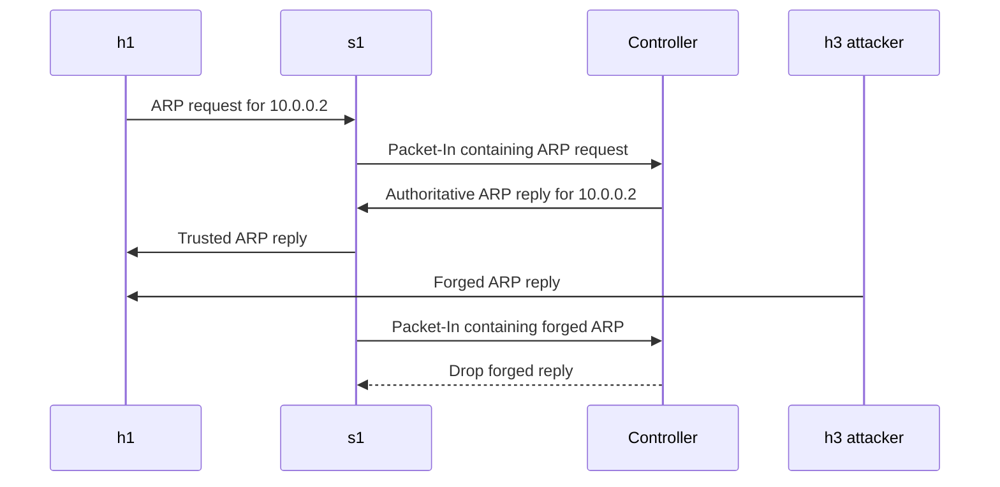

# Phase 5 - Protocol Diagrams

## Figure 1. ARP Packet Structure

```text
+----------------------+------------+----------------------------------+
| Field                | Bytes      | Description                      |
+----------------------+------------+----------------------------------+
| Hardware Type        | 2          | Ethernet = 0x0001                |
| Protocol Type        | 2          | IPv4 = 0x0800                    |
| HLEN                 | 1          | Hardware length = 6              |
| PLEN                 | 1          | Protocol length = 4              |
| Operation            | 2          | Request = 1, Reply = 2           |
| Sender MAC           | 6          | Claimed hardware source address  |
| Sender IP            | 4          | Claimed protocol source address  |
| Target MAC           | 6          | Target hardware address          |
| Target IP            | 4          | Target protocol address          |
+----------------------+------------+----------------------------------+
```

## Figure 2. Normal OpenFlow Control Plane Flow



## Figure 3. Poisoned Control Plane Flow



## Figure 4. ARP Proxy Defense Flow



## Figure 5. Mininet Topology

```text
                       POX Controller
                      127.0.0.1:6633
                             |
                             |
                          +--+--+
                          | s1  |
                          +--+--+
                             |
          +------------------+------------------+
          |                  |                  |
      h1 victim          h2 gateway         h3 attacker
      10.0.0.1           10.0.0.2           10.0.0.3
      00:00:00:00:00:01  00:00:00:00:00:02  00:00:00:00:00:03
```
